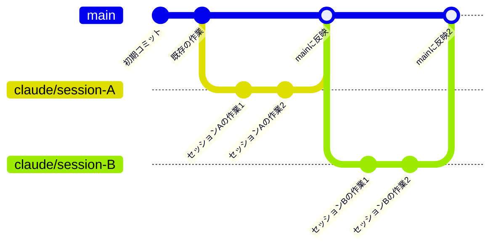
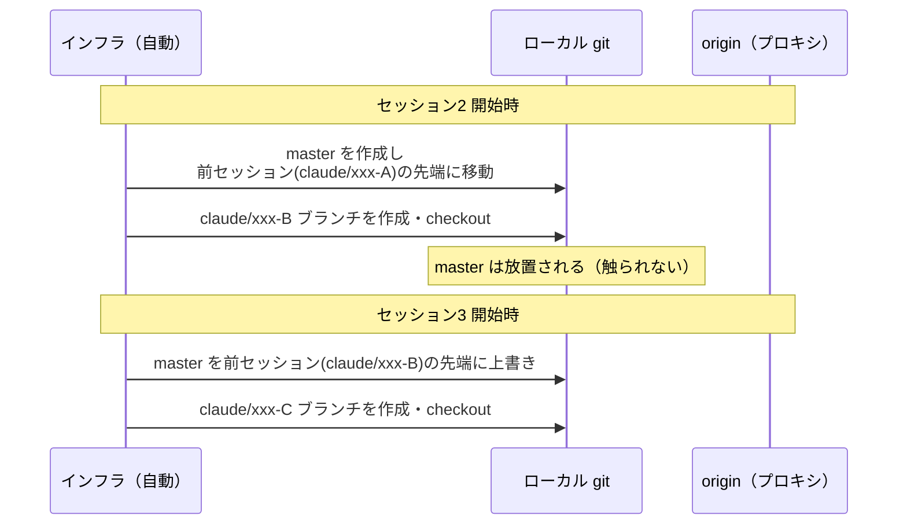
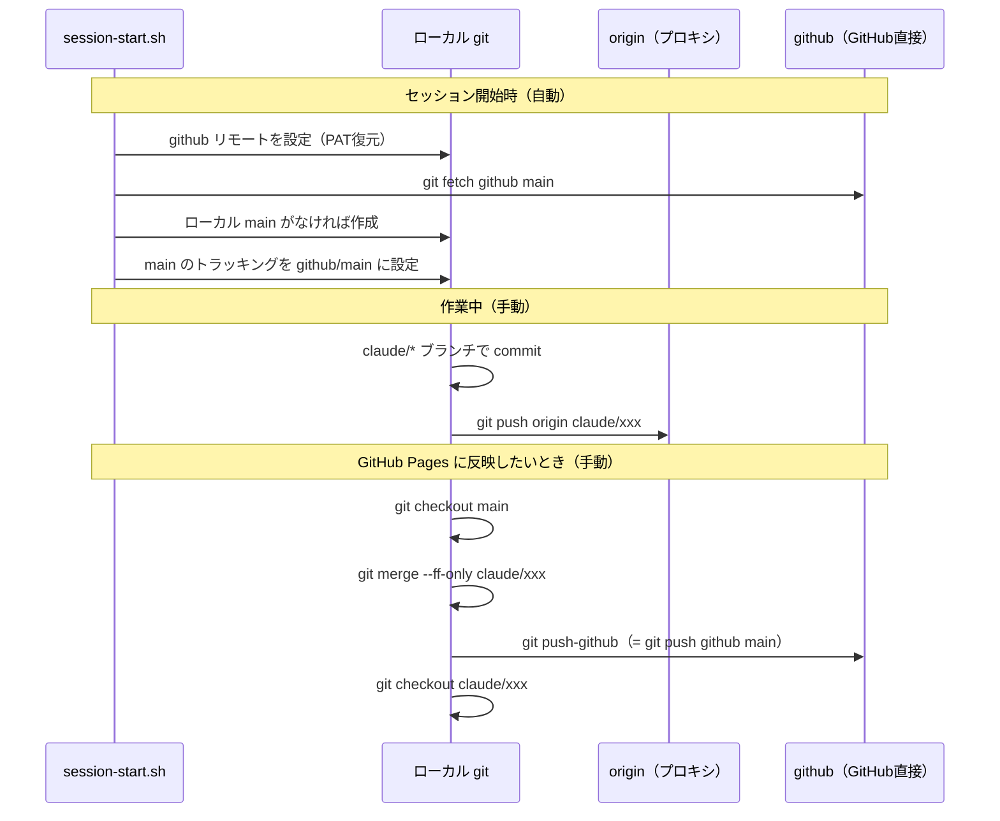
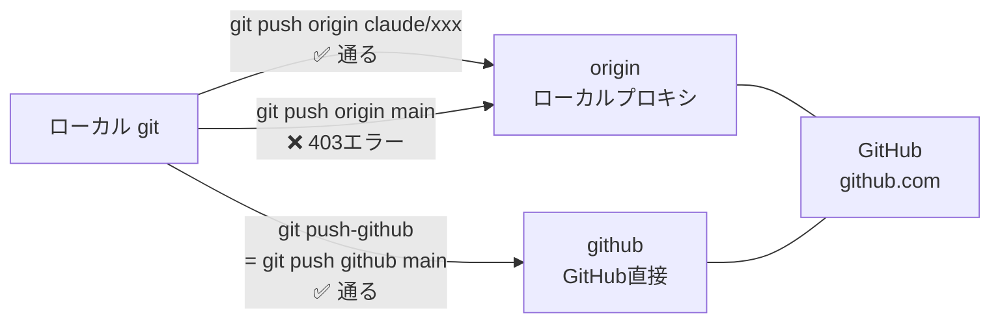

# Claude on the web のブランチ構造メモ

## 全体像

Claude on the web でコードを書くとき、裏側では以下のことが起きている。



セッションをまたいでも**本流は github/main ひとつ**。
各セッションの `claude/*` ブランチは使い捨ての作業スペースで、終わったら main に取り込まれる。

---

## なぜ `master` ブランチが存在するのか

Claude on the web は**セッションのたびにコンテナ（作業環境）がリセット**される。
新しいコンテナが起動するとき、インフラが自動で以下を実行しているらしい：

1. リポジトリをセットアップ
2. **前のセッションの `claude/*` ブランチを `master` という名前でローカルに作る**
3. 今回のセッション用の新しい `claude/*` ブランチに切り替える

結果として `master` は「**前セッションの終点マーカー**」として毎回自動生成される。



**削除しても次のセッションで復活する（ゾンビ）**。インフラが作るので防げない。
実害はないが、紛らわしい。通常の「main ブランチ」とは別物。

---

## `master` vs `main`：思想の違い

| | 通常の GitHub の main | Claude on the web の master |
|---|---|---|
| 役割 | プロジェクトの本流 | 前セッションの終点マーカー |
| 内容 | 最新の安定コード | 前セッションの claude/* の先端 |
| 永続性 | ずっと残る | セッションごとにリセットされる |
| push 先 | ここに集約する | push しても意味がない |

---

## 発見したバグと修正

### バグ：コンテナリセット後に `git push-github` が失敗する

`push-github` エイリアスの中身は：
```bash
git push github main
```

これは**ローカルの `main` ブランチ**を GitHub に送るコマンド。

ところがコンテナがリセットされると、ローカルの `main` が消える。
`session-start.sh` は「main のトラッキングを設定する」処理を持っていたが、
**main が存在しない場合に作成する処理がなかった**。

結果：毎セッション `push-github` がエラーになっていた。

```
error: src refspec main does not match any
```

### 修正内容（session-start.sh）

```bash
# 修正前
git fetch github main --quiet 2>/dev/null || true
git branch --set-upstream-to=github/main main 2>/dev/null || true
# → main がなければ --set-upstream-to が静かに失敗するだけ

# 修正後
git fetch github main --quiet 2>/dev/null || true
if ! git rev-parse --verify main &>/dev/null; then
  git branch main github/main  # ← なければ作る
fi
git branch --set-upstream-to=github/main main 2>/dev/null || true
```

---

## 作業フロー（まとめ）



---

## 各リモートの役割

| リモート名 | URL | 用途 |
|---|---|---|
| `origin` | ローカルプロキシ (127.0.0.1) | `claude/*` ブランチのみ push 可。main への push は 403 エラー |
| `github` | github.com (PAT 入り) | `main` を GitHub Pages に反映するための直接ルート |



---

## PAT の引き継ぎ方法

セッションをまたいでコンテナがリセットされても PAT（GitHub 認証トークン）が消えないように、
トークンを逆順に変換して `.claude/github-token.rev` に保存している。

詳細は [claude-on-the-web-setup.md](./claude-on-the-web-setup.md) を参照。
